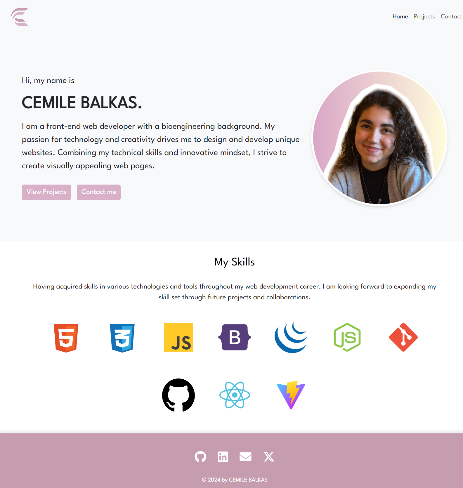

# Cemile Balkas - React Portfolio

## Description

Welcome to my portfolio built with React.js, where I showcase my technical and web design skills along with completed projects. This project includes the following components: Header, Home page, Projects page, and Contact page. FormKeep is integrated to to receieve the form submission on my personal email adress. The portfolio site is fully responsive, following a mobile-first design approach.

## Usage

My portfolio's design and layout:

## Deployment
The deployed website is available at:

[Cemile Balkas React Portfolio](https://cemileblks.github.io/react-portfolio/)

## Credits

- [FormKeep](https://formkeep.com/): Used for receiving form submissions.
- [SVGRepo](https://www.svgrepo.com/): A resource for icons used in this project.
- [Canva](https://www.canva.com/): Used for creating my logo.

## Installation

No specific installation steps are required for this project.

## License

This project is licensed under the MIT License.

